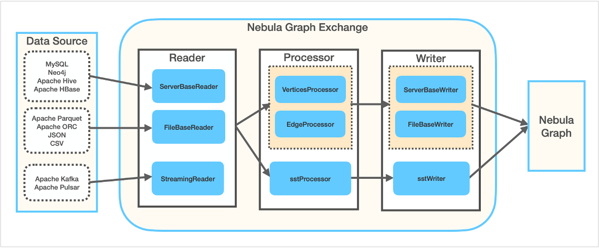

# 什么是Nebula Exchange

[Nebula Exchange](https://github.com/vesoft-inc/nebula-spark-utils/tree/v2.0.0/nebula-exchange)（简称Exchange）是一款Apache Spark&trade;应用，用于在分布式环境中将集群中的数据批量迁移到Nebula Graph中，能支持多种不同格式的批式数据和流式数据的迁移。

Exchange由Reader、Processor和Writer三部分组成。Reader读取不同来源的数据返回DataFrame后，Processor遍历DataFrame的每一行，根据配置文件中`fields`的映射关系，按列名获取对应的值。在遍历指定批处理的行数后，Writer会将获取的数据一次性写入到Nebula Graph中。下图描述了Exchange完成数据转换和迁移的过程。

## 适用场景

Exchange适用于以下场景：

- 需要将来自Kafka、Pulsar平台的流式数据，如日志文件、网购数据、游戏内玩家活动、社交网站信息、金融交易大厅或地理空间服务，以及来自数据中心内所连接设备或仪器的遥测数据等转化为属性图的点或边数据，并导入Nebula Graph数据库。

- 需要从关系型数据库（如MySQL）或者分布式文件系统（如HDFS）中读取批式数据，如某个时间段内的数据，将它们转化为属性图的点或边数据，并导入 Nebula Graph数据库。

- 需要将大批量数据生成Nebula Graph能识别的SST文件，再导入Nebula Graph数据库。

## 产品优点

Exchange具有以下优点：

- 适应性强：支持将多种不同格式或不同来源的数据导入Nebula Graph数据库，便于迁移数据。

- 支持导入SST：支持将不同来源的数据转换为SST文件，用于数据导入。

  > **说明**：仅Linux系统支持导入SST文件。

- 支持断点续传：导入数据时支持断点续传，有助于您节省时间，提高数据导入效率。

  > **说明**：目前仅迁移Neo4j数据时支持断点续传。

- 异步操作：会在源数据中生成一条插入语句，发送给Graph服务，最后再执行插入操作。

- 灵活性强：支持同时导入多个标签和边类型，不同标签和边类型可以是不同的数据来源或格式。

- 统计功能：使用Apache Spark&trade;中的累加器统计插入操作的成功和失败次数。

- 易于使用：采用HOCON（Human-Optimized Config Object Notation）配置文件格式，具有面向对象风格，便于理解和操作。

## 数据格式和来源

Exchange 2.0支持将以下格式或来源的数据转换为Nebula Graph能识别的点和边数据：

- 存储在HDFS的数据，包括：
  - [Apache Parquet](../use-exchange/ex-ug-import-from-parquet.md)
  - [Apache ORC](../use-exchange/ex-ug-import-from-orc.md)
  - [JSON](../use-exchange/ex-ug-import-from-json.md)
  - [CSV](../use-exchange/ex-ug-import-from-csv.md)

- [Apache HBase&trade;](../use-exchange/ex-ug-import-from-hbase.md)

- 数据仓库：[Hive](../use-exchange/ex-ug-import-from-hive.md)

- 图数据库：[Neo4j](../use-exchange/ex-ug-import-from-neo4j.md)（Client版本2.4.5-M1）

- 关系型数据库：[MySQL](../use-exchange/ex-ug-import-from-mysql.md)

- 流处理软件平台：[Apache Kafka&reg;](../use-exchange/ex-ug-import-from-kafka.md)

- 发布/订阅消息平台：[Apache Pulsar 2.4.5](../use-exchange/ex-ug-import-from-pulsar.md)